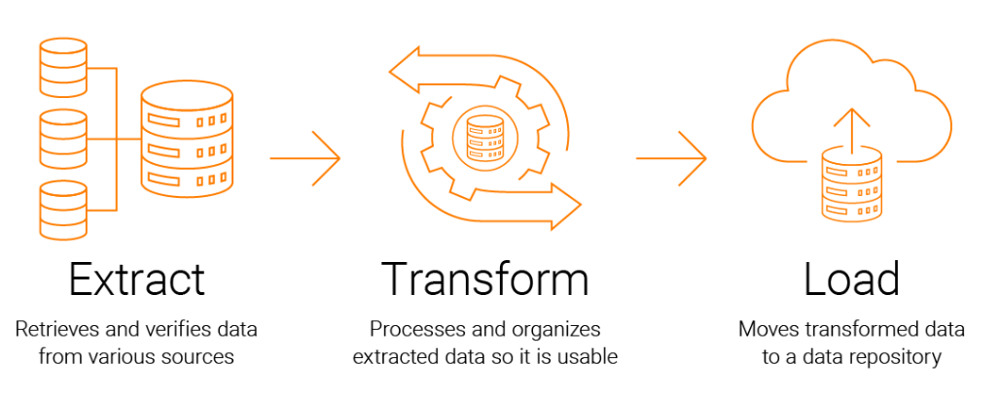
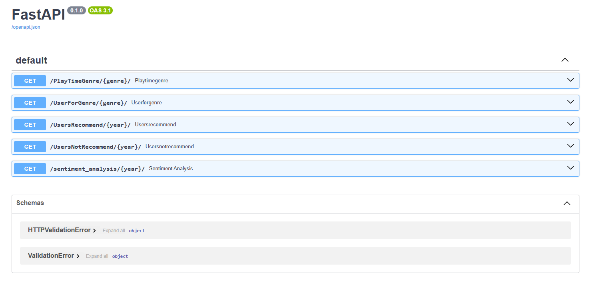
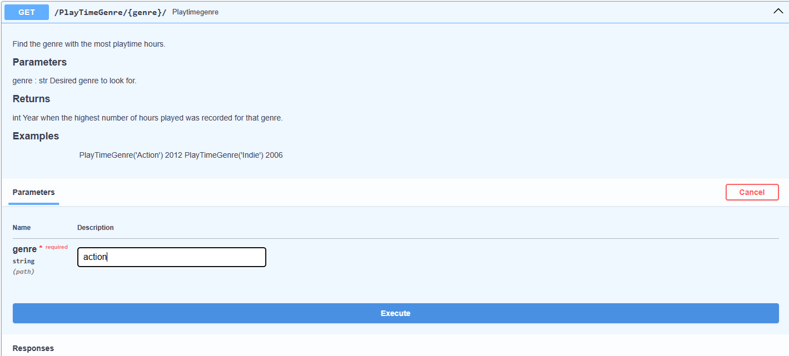
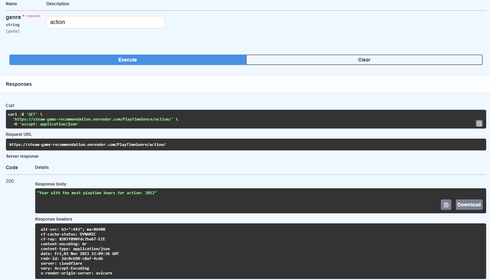

<h1 style = 'text-align: center'> STEAM™ Game Recommendation System </h1>

# This project simulates what a MLOps Engineer responsibilites and tasks are

## Deployment [Here](https://steam-game-recommendation.onrender.com/docs)

**_NOTE:_** This just covers the basics of a MLOps Engineer, it should be taken as a guide. The aim of this project is to create a Minimum Value Product (MVP) with just enough features to be usable for early-access customers.

# _Extraction, Transfrom & Load (ETL)_

- Our first step is to see what type of data are we working with, if it is text, images, videos, etc. We extract this data from a wide range of sources, depending our goal.

- Once our data has been identified, we move on to the second step which is manipulate said data. We do so by removing, changing, normalising any value that is of no use for the project. This part is key, since it will determine how our data will be loaded into a server or a web application. It will also impact on the program eficiency. For this particular case, we had to be very careful on how big our files were, since the server that we used **`(FastAPI)`** only allowed us to load up to 512MB.

- The last step is to load our cleaned data into a web application. As mentioned before, the server allowed us to allocate 512MB of storage. An impetuous transformation process could delay the whole deploying process, causing setbacks and jeopardize the project.

#### [Click Here To See The Whole Process](https://github.com/PatoMarzi/Steam_ML/blob/main/ETL.ipynb)

# _Exploratory Data Analysis (EDA)_

An EDA process consists of analyzing the data, previously processed in the ETL, to gain insights, uncover styles and pick out relationships between different values.

_A quick summary of what we did:_

> - Inspected the files to see how much memory they used
> - Deleted columns that were irrelevant
> - Review the data type of the columns, and change it in case it was not optimal
> - Ploted data to see if there were any outlier values and then discard it
> - Explored any relation between columns of the same or different

> This is a cyclic process, meaning we would come back from to this stage and do more research in case what we had was not enough to make a correct decision

#### [Click Here To See The Whole Process](https://github.com/PatoMarzi/Steam_ML/blob/main/EDA.ipynb)

# _Load Process_

Once we have a decent amount of data explored, we proceeded to test our API locally, making sure all functions were working properly, and then we loaded our application. In this case, we did so by deploying an API using `FastAPI` and `Render`, following the **REST API** criteria.

#### Check the script [Here](https://github.com/PatoMarzi/Steam_ML/blob/main/main.py)

# Preview of the Web App

_Interface of the web app_
 

 

_Output of the `PlayTimeGenre` function_
